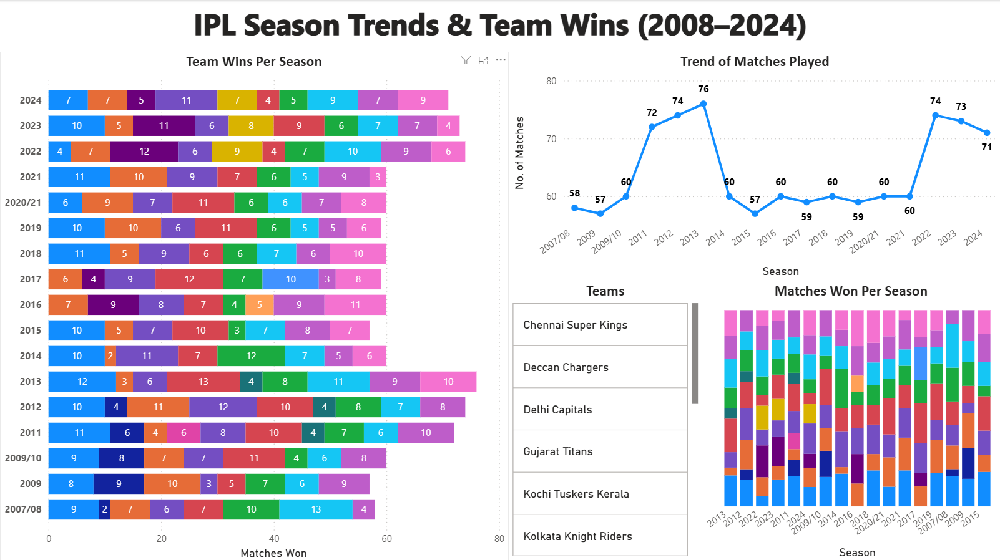
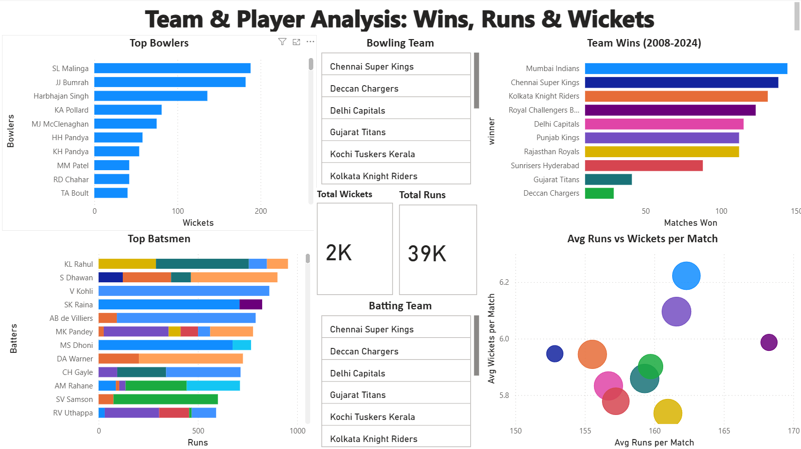

# IPL Data Analysis Dashboard

🏏 **Power BI Dashboard analyzing IPL matches, team dominance, and player performance trends (2008–2024).**

---

## 📌 Overview

This project uses **Python**, **SQLite**, and **Power BI** to clean and transform IPL ball-by-ball and match data. The final dashboard provides insights into season trends, winning patterns, and team performance balance.

---

## ✅ Key Highlights

- Total matches per season  
- Wins by teams each season  
- Runs scored vs wickets taken (batting/bowling balance)
- Top 10 batters by total runs  
- Top 10 bowlers by total wickets  

---

## 🛠️ Tools Used

- **Python** — data cleaning & transformation  
- **SQLite** — querying large CSVs  
- **Power BI** — interactive dashboards & visuals

---

## 📈 Screenshots

| Season Trends | Team Performance |
|---|---|
|  |  |

---

## 📂 How to Use

1. Clone/download this repo.
2. Open `IPL-Dashboard.pbix` in **Power BI Desktop**.
3. Explore visuals & filters.

**Data Source:** [Kaggle IPL Dataset](https://www.kaggle.com/datasets)

---

## 🔍 Insights

- Shows how different teams perform across seasons.
- Identifies batting-heavy vs bowling-heavy teams.
- Highlights top consistent performers in IPL history.

---

## 👤 Author

Aaryan  
[LinkedIn](https://linkedin.com/in/anarray) | [GitHub](https://github.com/An-Array)
